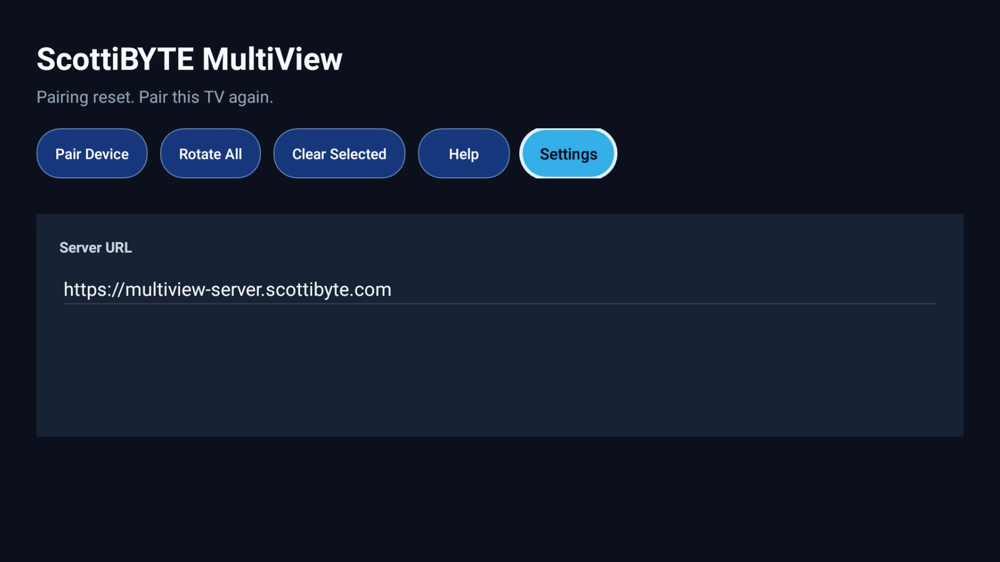
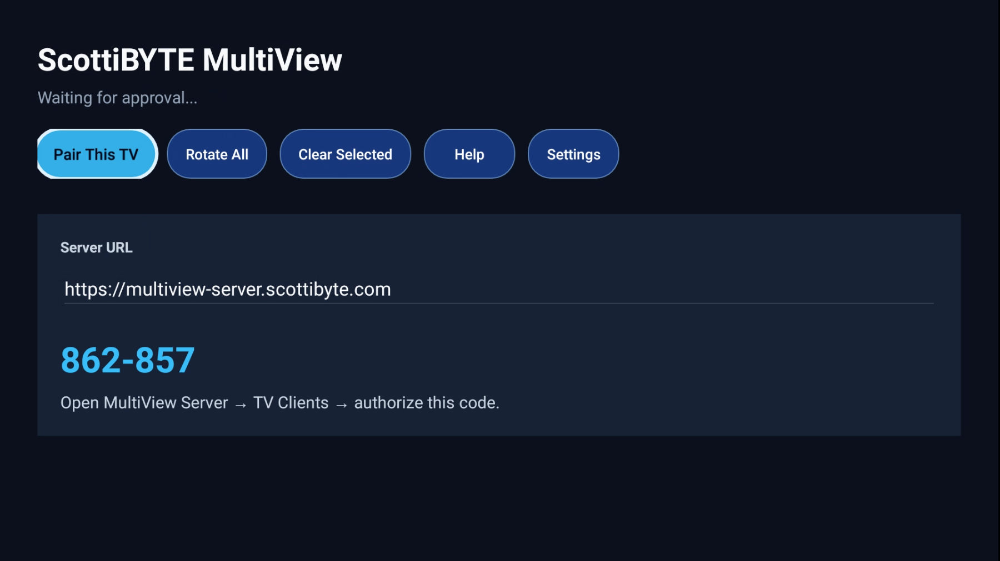
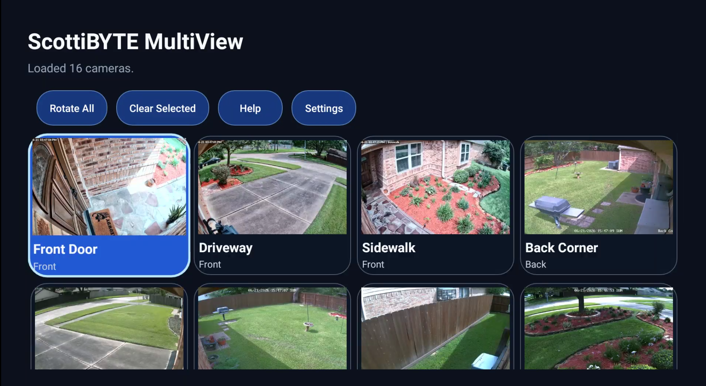
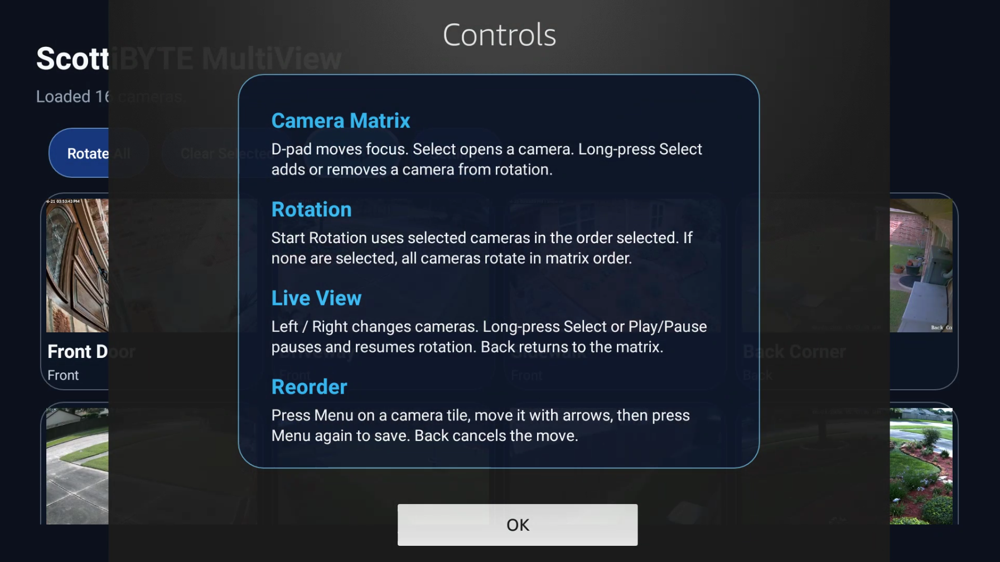
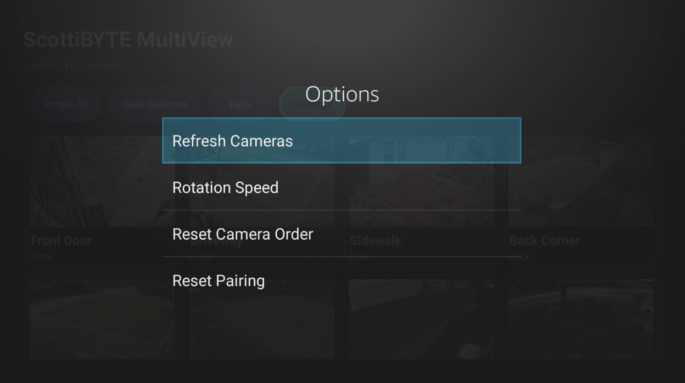
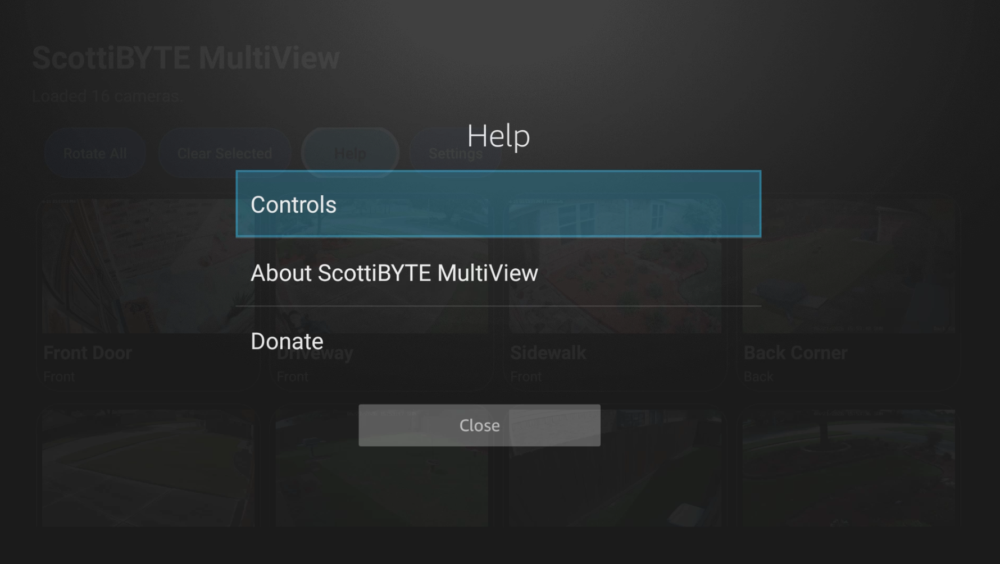
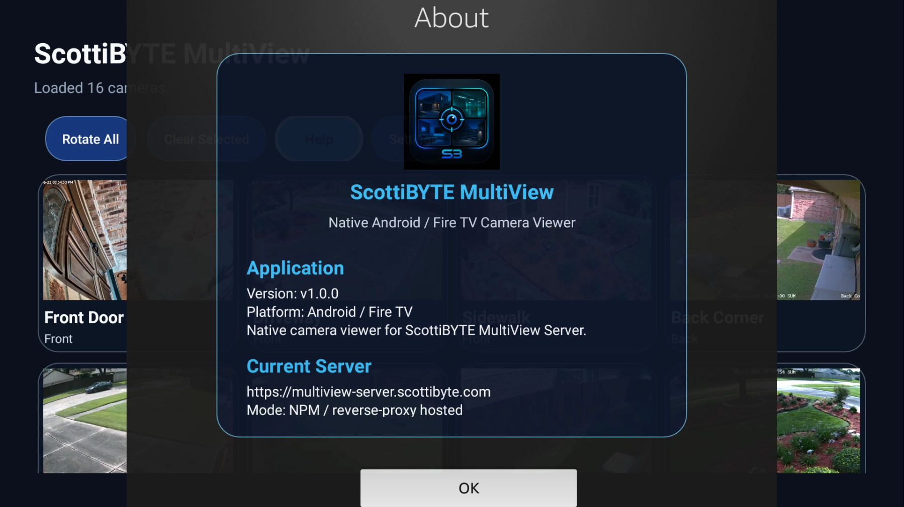
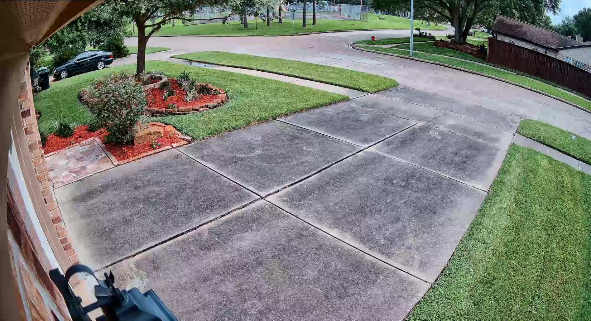
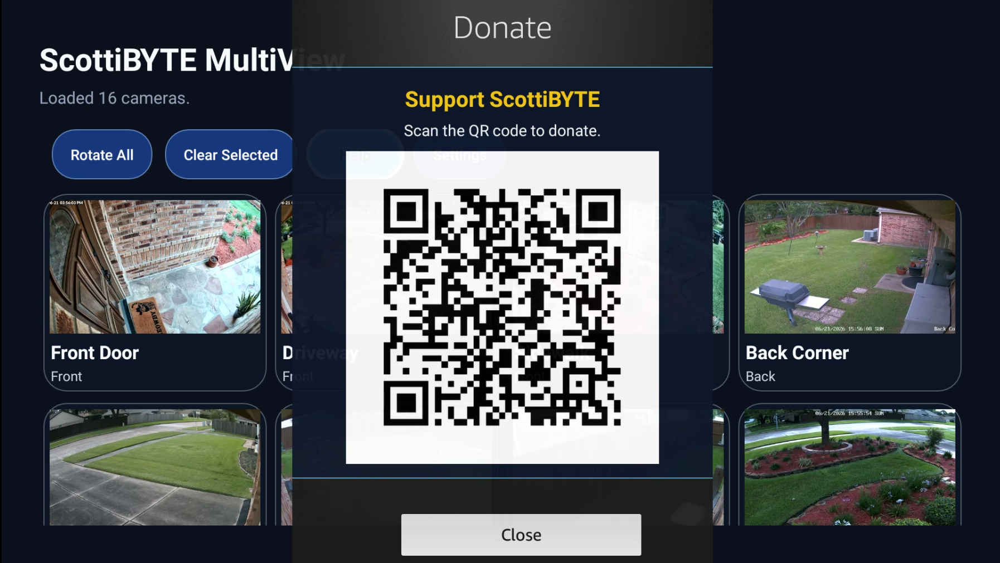

# ScottiBYTE MultiView Android TV / Fire TV Client

Native Android TV and Fire TV client for viewing camera streams from ScottiBYTE MultiView Server.

The client pairs with a self-hosted MultiView Server, receives an approved camera catalog, and plays TV-friendly HLS streams without exposing RTSP camera credentials to the TV device.

## Download APK

Download the latest Android TV / Fire TV APK from the GitHub Releases page:

https://github.com/ScottiBYTE/multiview-android-tv/releases/latest

Current release asset:

    ScottiBYTE-MultiView-AndroidTV-FireTV-v1.0.0-rc30.apk

## Companion Server

This app is designed to work with ScottiBYTE MultiView Server:

https://github.com/ScottiBYTE/multiview-server

The server manages RTSP camera definitions, camera groups, MediaMTX HLS publishing, thumbnail refresh, and TV client pairing.

## Screenshots

### Initial Screen

### Pairing Screen

### Dashboard

### Controls Help

### Settings Menu

### Help Screen

### About Screen

### Sample Camera View

### Donate Screen

## Features

- Native Android TV / Fire TV interface
- Pairing workflow with ScottiBYTE MultiView Server
- Secure server-approved camera catalog
- HLS camera playback
- Single-camera viewing
- Multi-camera dashboard view
- Camera rotation support
- Reorderable camera layout
- Remote-friendly controls
- Help and controls screens
- About and donate screens
- Branded launcher icon and TV banner

## Security Model

ScottiBYTE MultiView is designed so camera credentials remain on the self-hosted server.

- The TV client does not store RTSP camera usernames or passwords.
- The TV client does not receive raw RTSP camera URLs.
- The TV client must be paired and approved from the server web UI.
- The server provides the approved camera catalog and HLS playback URLs.
- Client access can be revoked from the MultiView Server TV Clients page.

## Requirements

- Android TV or Fire TV device
- ScottiBYTE MultiView Server
- Network access from the TV device to the MultiView Server
- HLS streams published by the server through MediaMTX

## Pairing Workflow

1. Install the ScottiBYTE MultiView Android TV / Fire TV client.
2. Enter the MultiView Server URL.
3. The TV client displays a pairing code.
4. Open the MultiView Server web UI.
5. Go to TV Clients.
6. Approve the pending pairing request.
7. The TV client receives authorization and loads the camera catalog.

## Build from Source

Open the project in Android Studio or build from the command line:

    ./gradlew assembleDebug

The debug APK will be created under:

    app/build/outputs/apk/debug/

## Current Development Version

    Version name: 1.0.0-rc30-leanback-banner
    Version code: 30
    Application ID: com.scottibyte.multiviewtv

## Related Project

- ScottiBYTE MultiView Server: https://github.com/ScottiBYTE/multiview-server

## Community

Need help with ScottiBYTE MultiView, the Android TV / Fire TV client, Docker deployment, MediaMTX, camera configuration, TV pairing, or other ScottiBYTE utilities?

Join the ScottiBYTE Rocket.Chat community:

https://go.rocket.chat/invite?host=chat.scottibyte.com&path=invite%2FaCh2oW
